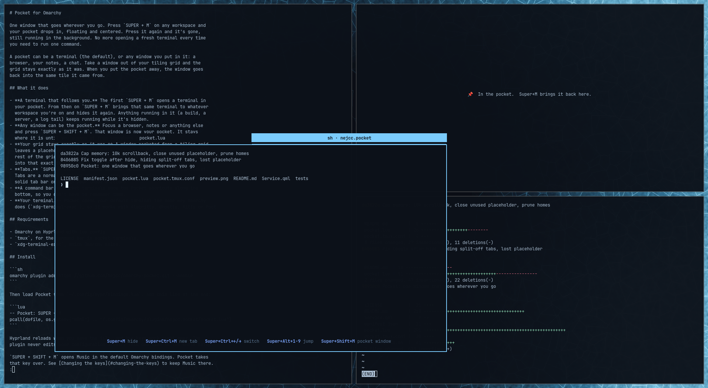

# Pocket for Omarchy

One window that goes wherever you go. Press `SUPER + M` on any workspace and
your pocket drops in, floating and centered. Press it again and it's gone,
still running in the background. No more opening a fresh terminal every time
you need to run one command.



A pocket can be a terminal (the default), or any window you put in it: a
browser, your notes, a chat. Take a window out of your tiling grid and the
grid stays exactly as it was. When you put the pocket away, the window goes
back into the same tile it came from.

## What it does

- **A terminal that follows you.** The first `SUPER + M` opens a terminal in
  your pocket. From then on `SUPER + M` brings that same terminal to whatever
  workspace you're on and hides it again. Anything running in it (a build, a
  server, a log tail) keeps running while it's hidden.
- **Any window can be the pocket.** Focus a browser, notes or anything else
  and press `SUPER + SHIFT + M`. That window is now your pocket. It stays
  where it is until you summon it from somewhere else.
- **Your grid stays exactly as it was.** A window pocketed from a tiling grid
  leaves a placeholder in its tile while it's out ("📌 In the pocket"). The
  rest of the grid doesn't move. Putting the pocket away swaps the window back
  into that exact tile, however deep it sits in the layout.
- **Tabs.** `SUPER + CTRL + M` opens another terminal as a tab in the pocket.
  Tabs are a normal Hyprland group, so they move and hide together, with a
  solid tab bar on top in your theme's colors.
- **A command bar.** Pocket terminals show the Pocket shortcuts along the
  bottom, so you don't have to remember them.
- **Your terminal.** Pocket opens your default terminal the same way Omarchy
  does (`xdg-terminal-exec`), so it works with Alacritty, Ghostty, Kitty or foot.

## Requirements

- Omarchy on Hyprland with Lua config.
- `tmux`, for the command bar in pocket terminals.
- `xdg-terminal-exec`, which Omarchy ships.

## Install

```sh
omarchy plugin add https://github.com/Nejcc/omarchy-pocket.git --enable
```

That's the whole setup. The plugin's service loads `pocket.lua` into Hyprland
(`hyprctl eval`) when the shell starts and again after every config reload, so
the keys work right away. It never edits your configuration.

Upgrading from 0.2? The `dofile` line in `~/.config/hypr/bindings.lua` is no
longer needed. Keeping it is harmless: Pocket loads once either way. Keep it
only if you change the keys (see below).

`SUPER + SHIFT + M` opens Music in the default Omarchy bindings. Pocket takes
that key over. See [Changing the keys](#changing-the-keys) to keep Music there.

## Usage

| Shortcut | Does |
|---|---|
| `SUPER + M` | Bring the pocket here. Press again to hide it. With an empty pocket, opens a terminal in it. |
| `SUPER + CTRL + M` | New terminal tab in the pocket |
| `SUPER + SHIFT + M` | Make the focused window your pocket |
| `SUPER + CTRL + ←` / `→` | Previous / next tab (Omarchy default) |
| `SUPER + ALT + 1`…`9` | Jump to tab 1–9 (Omarchy default) |
| `SUPER + ALT + TAB` | Cycle tabs (Omarchy default) |

You can also click a tab in the tab bar, or hold `SUPER + ALT` and scroll over it.

### Where the pocket goes

| The pocket is… | `SUPER + M` shows it by… | and hides it by… |
|---|---|---|
| a terminal Pocket opened | moving it to your workspace | parking it on a hidden workspace |
| a window from a tiling grid | floating it out to your workspace, a placeholder keeps its tile | swapping it back into its tile |
| a floating window | moving it to your workspace | parking it on a hidden workspace |

On the grid window's own workspace, `SUPER + M` just focuses it where it is.

### One pocket at a time

`SUPER + SHIFT + M` replaces what's in your pocket. The previous pocket is
released where it belongs: a grid window goes back into its tile, and a hidden
terminal comes out onto your current workspace as a normal window, so nothing
is ever lost on a hidden workspace.

### Closing things

Close a pocket terminal the usual way (`exit`, or `SUPER + W`). The next
`SUPER + M` opens a fresh one. Closing a tab ends its tmux session, so nothing
keeps running behind your back. If you close a grid window while it's out of
its grid, its placeholder closes too and the grid closes the gap. Don't close
the placeholder itself: while it holds the tile, the window can go back to
exactly that spot.

## Changing the keys

`pocket.lua` binds its three keys when it loads. Pocket also sets a global
`pocket` table with `toggle`, `new_tab`, `adopt`, `show` and `hide`. To use
other keys, load Pocket yourself in `~/.config/hypr/bindings.lua` and rebind
after it. The service sees Pocket is already loaded and leaves your keys alone:

```lua
pcall(dofile, os.getenv("HOME") .. "/.config/omarchy/plugins/nejcc.pocket/pocket.lua")

-- Pocket on SUPER + Z instead of SUPER + M
hl.unbind("SUPER + M")
o.bind("SUPER + Z", "Toggle pocket", function() pocket.toggle() end)

-- Give SUPER + SHIFT + M back to Music and pocket windows with SUPER + SHIFT + Z
hl.unbind("SUPER + SHIFT + M")
o.bind("SUPER + SHIFT + Z", "Put window in pocket", function() pocket.adopt() end)
o.bind("SUPER + SHIFT + M", "Music", { omarchy = "spotify" })
```

The same functions work from a script:

```sh
hyprctl eval 'pocket.toggle()'
```

## Look and feel

- **Size.** A pocket terminal opens at 60% of the monitor, centered. A grid
  window floated out of its grid gets the same size.
- **Command bar.** It comes from `pocket.tmux.conf` next to `pocket.lua`. The
  tmux server is separate (`tmux -L pocket`), so your own tmux sessions and
  config are untouched.
- **Scrollback.** Each tab keeps 10,000 lines of scrollback (tmux
  `history-limit`), enough for a long log tail without the memory growing
  for days. Change it in `pocket.tmux.conf`.
- **Tab titles.** Each tab shows the running command and folder
  (`zsh · projects`), so tabs can be told apart.
- **Tab bar.** The bar is solid, not see-through. The active tab uses the
  theme's accent color, other tabs its background. The colors come from the
  current Omarchy theme and follow it when you switch themes (`omarchy theme
  set` reloads Hyprland). They apply to every Hyprland group, not just the
  pocket.

## Uninstall

```sh
omarchy plugin remove nejcc.pocket
```

Pocket's keys stay bound until Hyprland next reloads its config (save any
Hyprland config file, or run `hyprctl reload`). If you added a `dofile` line or
rebinds to `~/.config/hypr/bindings.lua`, delete them. Pocket keeps no settings files; adopted windows
carry their home workspace in a window tag. A pocket terminal still open stays
open as a normal window. Close it when you're done.

## Tests

```sh
python tests/check.py  # offline manifest, syntax, reload, and guard checks
tests/stress.sh   # live stress test (takes over workspaces 8 and 9 for about a minute)
```

The stress test requires an empty pocket and empty workspaces 8 and 9; it
skips before changing anything if either is in use. It opens four terminals
in a tiling grid, pockets each one in
turn, and shows and hides it three times from another workspace. After every
round trip it checks that every window in the grid is back to the pixel. Then
it toggles 40 times with no pause, and checks tabs: hiding a pocketed grid
window that has a terminal tab sends the window home and parks the tab. It
closes its windows at the end. Whatever was in your pocket before is released
onto workspace 8.

## How it works

Pocket is Hyprland Lua, not shell QML: `pocket.lua` runs inside Hyprland's
config. It finds pocket windows by a `pocket` window tag, so any app can be
one. Terminals Pocket opens itself are tagged as they open.

A window pocketed from a grid also gets a `pocket-home` tag and a placeholder
terminal, parked on a hidden workspace. To take the window out, the
placeholder tiles in beside it and the two swap places. The window then
floats away from the placeholder's new tile, and that tile is what closes. The
placeholder is left in the original tile, so the rest of the grid never moves.
Putting it back is the same in reverse. Each step is one Lua call, so the
round trip through the home workspace is never drawn on screen.

The plugin's `Service.qml` is an empty service: the marketplace needs a shell
entry point, but all the work happens in Hyprland.

## Limitations

- One pocket at a time. `SUPER + SHIFT + M` replaces it.
- A grid window with terminal tabs splits from its tabs when hidden: the
  window goes back to its tile and the tabs park. Summoned again, they come
  back as separate floating windows.
- Grid restoring is tested with the dwindle layout, Omarchy's default.
- The placeholder is a terminal (about 25 MB). It stays parked while a grid
  window is your pocket, so round trips are instant, and closes when the
  pocket no longer holds a grid window.
- The pocket opens on the focused monitor, sized to it.
- If the placeholder is closed while its window is out, the window can't
  return to its exact tile. It tiles back into its home workspace wherever
  the layout puts it, and the next round trip is exact again. The home workspace
  is stored in a window tag, so it survives Hyprland config reloads. Replacing
  the pocket removes that tag from the released window.

## Troubleshooting

If `SUPER + M` does nothing, check that Pocket is loaded:

```sh
hyprctl repl 'return type(pocket)'   # prints "table" when loaded
```

If it doesn't say `table`, check that the plugin is enabled
(`omarchy plugin list`), run `hyprctl reload` to make the service load it again,
and look at `hyprctl configerrors`. If you load Pocket from `bindings.lua`
yourself, check the path there.

## Optional per-monitor integration

Pocket works independently. With the proposed version 1 integration API in
[per-monitor workspaces](https://github.com/Nejcc/omarchy-per-monitor-workspaces),
it can also keep an adopted window's saved home attached to its workspace when
the provider relocates or swaps workspaces. Load per-monitor before Pocket to
connect automatically. If Pocket loads first, add this after both loaders:

```lua
if pocket and pocket.connect_workspaces then pocket.connect_workspaces() end
```

The call is safe with no provider or an older provider. Connections are recreated
on config reload. This integration needs no changes to Pocket's normal shortcuts.

## See also

- [Omarchy motions](https://github.com/Nejcc/omarchy-motions): jump to, move
  and resize any window on any workspace with short vim-style commands.
- [Keybindings hint](https://github.com/Nejcc/omarchy-keybindings-hint): hold
  `SUPER` to see what every `SUPER + key` does, Pocket's keys included.

## License

MIT. See [LICENSE](LICENSE).
